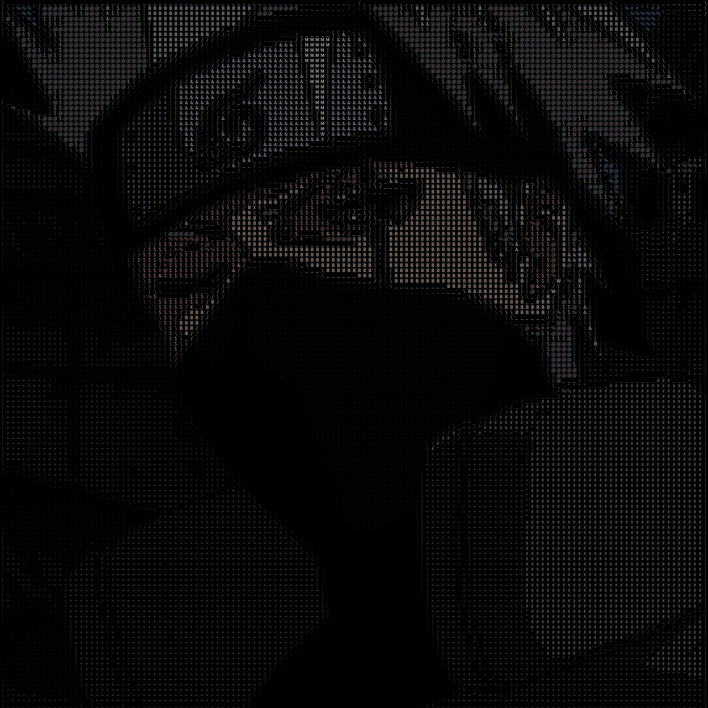

# ASCII Art Video Processing

This Processing sketch transforms live video input into dynamic ASCII art with edge detection capabilities.

## Examples

Here are some example outputs from the sketch:

### Original Image

### Without Edge Detection

### With Edge Detection

These images demonstrate the difference between the standard ASCII art output and the version with edge detection enabled.

## Features

- Real-time video to ASCII conversion
- Edge detection using Sobel operators
- Monochrome and color modes
- Image saving functionality

## Controls

- 's': Save the current frame as a PNG image
- 'm': Toggle between monochrome and color modes
- 'e': Toggle edge detection on/off

## Requirements

- Processing 3 or later
- Processing Video library

## Setup

1. Install Processing from [processing.org](https://processing.org/)
2. Install the Video library through Processing's Contribution Manager
3. Open ASCII.pde in Processing and run the sketch

## Customization

- Adjust `pxSize` to change the resolution of the ASCII art
- Modify the `density` string to use different characters for brightness levels
- Change `bg` and `txtCol` to alter the background and text colors

## How it works

The sketch captures video from your webcam, processes each frame to convert it into ASCII characters based on pixel brightness, and optionally applies edge detection. The result is a real-time ASCII art representation of the video input.
